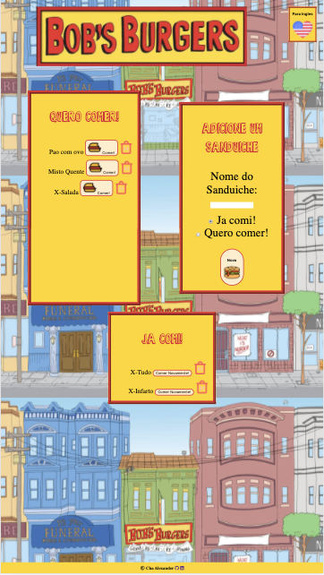

<h1 align= "center">Bob's</h1> 
<h2>Live Link</h2>
<h3><a href= "https://bobs-burger-ca.herokuapp.com/">Live Link</a></h3>  
<h2> Table of Contents </h2>
<li><a href="#description">Description</a></li>  
<li><a href="#installation">Installation</a></li> 
<li><a href="#tech">Technology Stack</a></li> 
<li><a href="#usage">Usage</a></li> 
<li><a href="#screen">ScreenShots</a></li> 
<li><a href="#contributors">Contributors</a></li>   
<li><a href="#contact">Contact</a></li> 
<h2 id="description"> Description </h2>

Application bi-lingual created to keep track of the burgers you want to eat.
   
<h2 id="installation"> Installation </h2>

npm i, Json file included (in case you forked!)
          
<h2 id="tech"> Technology Stack </h2>          
<ul>
<li>Node.js</li>
<li>JavaScript</li>
<li>MySQL</li>
</ul>          
<h2 id="usage"> Usage </h2>
<ol>
<li>Choose your page. Brazilian-Portuguese or English.</li>
<li>Add a new burger.</li>
<li>Check if you want to leave on the want to eat side or ate side.</li>
<li>Whenever you eat the burger, sent it to the ate side, and vice-versa</li>
<li>Delete whatever burger you don't need anymore</li>
</ol>   
<h2 id="screen"> ScreenShoots </h2>
<h4> Desktop </h4>

<h4> Mobile </h4>

<h2 id="contributors"> Contributors </h2>

<a href= "https://github.com/chaalexander">@chaalexander</a>
 
<h2 id="contact"> Contact </h2>         
<h5> Name: Charlenne Alexander </h5>       
<h5><a href= "https://github.com/chaalexander">GitHub</a></h5>  
<h5><a href= "https://chaalexander.github.io/">Portfolio</a></h5>  
<h5><a href= "mailto:charlennep@gmail.com">charlennep@gmail.com</a></h5>       
<h5><a href= "https://www.linkedin.com/in/cha-alexander">LinkedIn</a></h5>
